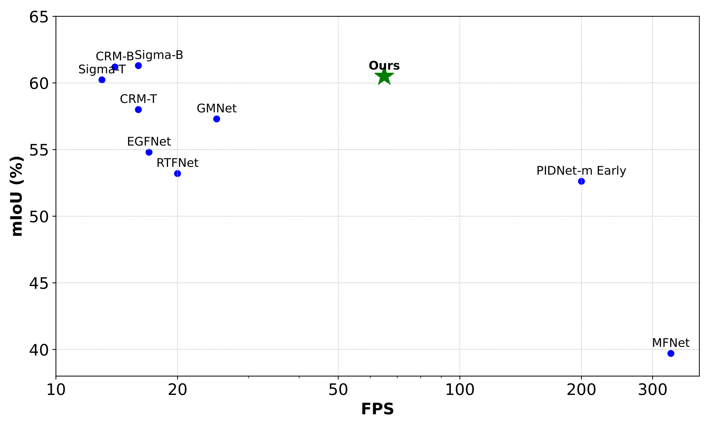
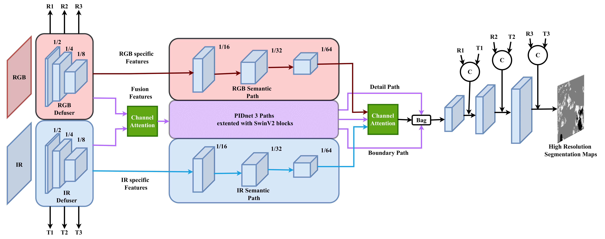
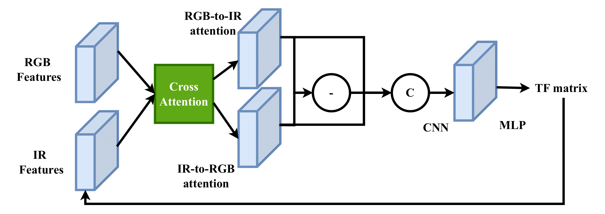

# RoboFireFuseNet

This is the official repository for our recent work: RoboFireFuseNet: Robust Fusion of Visible and Infrared Imaging for Real-Time Flame and Smoke Segmentation in Wildfire Scenarios

### Abstract
Concurrent segmentation of flames and smoke is a
challenging task, particularly when relying on a single spectral
band. Leveraging the combination of visible (RGB) and infrared
(thermal) modalities in wildfire imaging significantly enhances the
accuracy and robustness of fire segmentation systems. However,
fusing these modalities presents notable challenges due to the
high diversity in data representation, with certain features being
exclusive to specific spectra. This paper evaluates the effectiveness
of RGB and thermal data for flame and smoke segmentation,
exploring various fusion strategies. A novel intermediate fusion
architecture is proposed, built upon a real-time, state-of-the-
art segmentation model augmented with attention mechanisms
and specifically designed to address the complexities of modality
fusion. Practical challenges, such as robustness to unregistered
inputs and sensor failures are also addressed, resulting in one
of the first models to effectively tackle the issue of unregistered
fusion. The lightweight model achieves comparable accuracy to
state-of-the-art architectures on urban datasets and surpasses
them in wildfire scenarios, offering real-time capabilities and
enhanced robustness suitable for robotic applications in dynamic
and high-stakes environments.

   <h4>MIOU vs FPS on MFNet dataset and RTX 4090</h4>
  

## Highlights

- 🔥 <b>Lightweight & Powerful Multimodal Segmentation</b>: Our real-time fusion model outperforms many SOTA models with fewer parameters in segmentation task with visible and thermal imaging.
- 🚁 <b>Smoke & Flame Segmentation</b>: Excels in dense smoke conditions, accurately segmenting concurently flames and smoke.
- 🛠️ <b>Robust Fusion</b>: Handles modality misalignment and sensor failures achieving semantic segmentation fusing unregistered inputs.
   
## Updates
- Paper is submitted to ...

## Demo

## Overview
Schematic overview of the proposed fusion model and the robust module.

### Fusion Architecture
Our model builds on PIDNet-Small by integrating SwinV2-T Transformer blocks to enhance capacity and capture long-range dependencies. We introduce dual modality paths to preserve and mine modality-specific features, and replace simple upscaling with a U-Net style decoder using shortcut connections. This design restores spatial dimensions while retaining essential small-scale features for improved segmentation.

### Robust module
The optional, lightweight robustness module enhances modality alignment by iteratively estimating the optimal affine transformation to align Infrared and RGB modalities. It leverages cross-attention between the two modalities to generate a misalignment-aware map, ensuring more accurate feature fusion and improved robustness.

### 📊 **Performance Comparison on Urban Scenes (MFNet)**
| **Method**                | **Avg Recall (%)** | **MIoU (%)** | **Params (M)** |
|--------------------------|-------------------|---------------|-----------------|
| [PIDNet-m RGB](https://example.com)  | 65.59            | 51.52         | 34.4            |
| [PIDNet-m IR](https://example.com)   | 65.27            | 50.70         | 34.4            |
| [PIDNet-m Early](https://example.com) | 69.59            | 52.62         | 34.4            |
| [MFNet](https://example.com)          | 59.1             | 39.7          | **0.73**         |
| [RTFNet](https://example.com)        | 63.08            | 53.2          | 185.24          |
| [GMNet](https://example.com)        | **74.1**         | 57.3          | 153             |
| [EGFNet](https://example.com)       | 72.7             | 54.8          | 62.5            |
| [CRM-T](https://example.com)        | -                | 59.7          | 59.1            |
| [Sigma-T](https://example.com)       | 71.3             | 60.23         | 48.3            |
| **Ours**                                             | 71.1             | **60.6**      | 29.5            |
### 📊 **Performance Comparison on FLAME2**
| **Method**                | **Avg Recall (%)** | **MIoU (%)** | **Params (M)** |
|--------------------------|-------------------|---------------|-----------------|
| [PIDNet-RGB](https://example.com)  | 75.66            | 61.21         | 34.4            |
| [PIDNet-IR](https://example.com)   | 83.05            | 58.71         | 34.4            |
| [PIDNet-Early](https://example.com) | 88.25            | 73.90         | 34.4            |
| [MFNet](https://example.com)        | 93.53            | 80.26         | **0.73**         |
| [RTFNet](https://example.com)      | 73.87            | 65.42         | 185.24          |
| [GMNet](https://example.com)      | 67.53            | 54.08         | 153             |
| [EGFNet](https://example.com)     | 74.27            | 60.98         | 62.5            |
| [CRM-T](https://example.com)      | -                | -             | 59.1            |
| [Sigma-T](https://example.com)     | 92.6             | 86.27         | 48.3            |
| **Ours**                            | **94.34**        | **88.39**     | 29.5            |

## Usage

### 0. Setup
- Install python requirements: `pip install -r requirements.txt`
- Download the [weights](LINK) inside the weights folder.
- Download the [Data](LINK) inside the data folder.
  
### 2. Training
Customize configurations via the config/ folder or override them with inline arguments.
- train fusion model on wildfire: `python train.py --yaml_file wildfire.yaml --LR 0.001 --BATCHSIZE 5 --WD 0.00005 --SESSIONAME "train_simple" --EPOCHS 500 --DEVICE "cuda:0" --STOPCOUNTER 30 --ONLINELOG False --ROBUST_TRAIN False --PRETRAINED "weights/pretrained_480x640_w8_2_6.pth" --OPTIM "ADAM" --SCHED "COS"`
- train robust module on wildfire: `python train.py --yaml_file wildfire.yaml --LR 0.001 --BATCHSIZE 5 --WD 0.00005 --SESSIONAME "train_robust" --EPOCHS 500 --DEVICE "cuda:0" --STOPCOUNTER 30 --ONLINELOG False --ROBUST_TRAIN False --PRETRAINED "weights/robo_fire_aug.pth" --OPTIM "ADAM" --SCHED "COS"`
- train fusion model on urban dataset: `python train.py --yaml_file urban.yaml --LR 0.001 --BATCHSIZE 5 --WD 0.00005 --SESSIONAME "train_simple" --EPOCHS 500 --DEVICE "cuda:0" --STOPCOUNTER 30 --ONLINELOG False --ROBUST_TRAIN False --PRETRAINED "weights/pretrained_480x640_w8_2_6.pth" --OPTIM "ADAM" --SCHED "COS"`
  
### 3. Testing
Customize configurations via the config/ folder or override them with inline arguments.

## Citation
(TODO: complete the information when paper accepted)

## Acknowledgment
<a id="1">[1]</a> : PIDnet: Xu, Jiacong et al. “PIDNet: A Real-time Semantic Segmentation Network Inspired by PID Controllers.” 2023 IEEE/CVF Conference on Computer Vision and Pattern Recognition (CVPR) (2022): 19529-19539.  
<a id="2">[2]</a> : FLAME2: Bryce Hopkins, Leo O'Neill, Fatemeh Afghah, Abolfazl Razi, Eric Rowell, Adam Watts, Peter Fule, Janice Coen, August 29, 2022, "FLAME 2: Fire detection and modeLing: Aerial Multi-spectral imagE dataset", IEEE Dataport, doi: https://dx.doi.org/10.21227/swyw-6j78.
