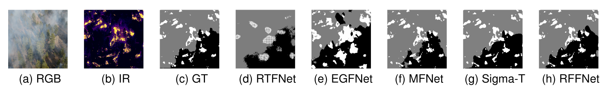

# RoboFireFuseNet

This is the official repository for our recent work: RoboFireFuseNet: Robust Fusion of Visible and Infrared WildfireImaging for Real-Time Flame and Smoke Segmentation

### Abstract
Concurrent segmentation of flames and smoke is challenging, as smoke frequently obscures fire in RGB imagery. Existing multimodal models are either too computationally demanding for real-time deployment or too lightweight to capture fine fire details that may escalate into large wildfires. Moreover, they are typically trained and validated on simplistic datasets, such as Corsican and FLAME1, which lack the dense smoke occlusion present in real-world scenarios. We introduce RoboFireFuseNet (RFFNet), a real-time deep neural network that fuses RGB and infrared (IR) data through attention-based mechanisms and a detail-preserving decoder. Beyond strong performance, RFFNet establishes a benchmark on a challenging, real-world wildfire dataset with dense smoke, creating a foundation for fair comparison in future flame-and-smoke segmentation research. Despite its lightweight design, it achieves state-of-the-art results on a general urban benchmark, demonstrating both efficiency and versatility. Its combination of accuracy, real-time performance, and multimodal fusion makes RFFNet well-suited for proactive, robust and accurate wildfire monitoring.

   <h4>MIOU vs FPS on MFNet dataset and RTX 4090</h4>
  

## Highlights

- 🔄 **Multimodal Fusion**: Combines CNN and attention blocks to extract cross-modal, spatiotemporal features.  
- ⚡ **Real-Time Performance**: Designed for lightweight, real-world wildfire detection with high efficiency.  
- 🔥 **Flame & Smoke Segmentation**: Handles dense smoke coverage while detecting small flame spots.  
- 🎯 **Compact & Efficient**: Achieves competitive segmentation accuracy with fewer parameters than state-of-the-art models.  
   
## Updates
- Paper is submitted to ...

## Demo

## Overview
Schematic overview of the proposed fusion model and

### Fusion Architecture
Our model enhances PIDNet-Small by integrating SwinV2-T Transformer blocks, improving capacity and capturing long-range dependencies. To better preserve and extract modality-specific features, we introduce dedicated modality pathways. Additionally, we replace basic upscaling with a U-Net-style decoder, enhancing spatial reconstruction and producing high-resolution segmentation maps.

### 📊 **Performance Comparison on FLAME2**
| **Method**                | **Avg Recall (%)** | **MIoU (%)** | **Params (M)** |
|--------------------------|-------------------|---------------|-----------------|
| [PIDNet-RGB](https://github.com/XuJiacong/PIDNet)  | 75.66            | 61.21         | 34.4            |
| [PIDNet-IR](https://github.com/XuJiacong/PIDNet)   | 83.05            | 58.71         | 34.4            |
| [PIDNet-Early](https://github.com/XuJiacong/PIDNet) | 88.25            | 73.90         | 34.4            |
| [MFNet](https://github.com/haqishen/MFNet-pytorch)        | 93.53            | 80.26         | **0.73**         |
|[EFSIT*](https://github.com/hayatkhan8660-maker/Fire_Seg_Dataset)  | 90.15 | 80.09 |  4.8 |
| [RTFNet](https://github.com/yuxiangsun/RTFNet)      | 73.87            | 65.42         | 185.24          |
| [GMNet](https://github.com/Jinfu0913/GMNet)      | 67.53            | 54.08         | 153             |
| [EGFNet](https://github.com/ShaohuaDong2021/EGFNet)     | 74.27            | 60.98         | 62.5            |
| [CRM-T](https://github.com/UkcheolShin/CRM_RGBTSeg)      | -                | -             | 59.1            |
| [Sigma-T](https://github.com/zifuwan/Sigma)     | 92.6             | 86.27         | 48.3            |
| **Ours**                            | **94.37**        | **88.17**     | 29.5            |

### 📊 **Performance Comparison on Urban Scenes (MFNet)**
| **Method**                | **Avg Recall (%)** | **MIoU (%)** | **Params (M)** |
|--------------------------|-------------------|---------------|-----------------|
| [PIDNet-m RGB](https://github.com/XuJiacong/PIDNet)  | 65.59            | 51.52         | 34.4            |
| [PIDNet-m IR](https://github.com/XuJiacong/PIDNet)   | 65.27            | 50.70         | 34.4            |
| [PIDNet-m Early](https://github.com/XuJiacong/PIDNet) | 69.59            | 52.62         | 34.4            |
| [MFNet](https://github.com/haqishen/MFNet-pytorch)          | 59.1             | 39.7          | **0.73**         |
| [RTFNet](https://github.com/yuxiangsun/RTFNet)        | 63.08            | 53.2          | 185.24          |
| [GMNet](https://github.com/Jinfu0913/GMNet)        | **74.1**         | 57.3          | 153             |
| [EGFNet](https://github.com/ShaohuaDong2021/EGFNet)       | 72.7             | 54.8          | 62.5            |
| [CRM-T](https://github.com/UkcheolShin/CRM_RGBTSeg)        | -                | 59.7          | 59.1            |
| [Sigma-T](https://github.com/zifuwan/Sigma)       | 71.3             | 60.23         | 48.3            |
| **Ours**                                             | 71.1             | **60.6**      | 29.5            |

## Usage

### 0. Setup
- Install python requirements: `pip install -r requirements.txt` or recommender `Python 3.10.12`
- Download the [weights](https://drive.google.com/drive/folders/1wldeSDx5VVjynABJqm55RDREAnPonk5y?usp=sharing) inside the weights folder.
- Download the preprocessed [data](https://drive.google.com/drive/folders/15bsStvQWBpMY1bXW3Wi-uliczz1-Zko8?usp=drive_link) inside the data folder. We include our annotations on public FLAME2 dataset.
- Download the [split](https://drive.google.com/file/d/15zglyds0vFhUJmwbwXorlszqs5jZ-ga7/view?usp=sharing) from Corsican.
  
### 2. Training
Customize configurations via the config/ folder or override them with inline arguments.
- train fusion model on wildfire: `python train.py --yaml_file wildfire.yaml --LR 0.001 --BATCHSIZE 5 --WD 0.00005 --SESSIONAME "train_simple" --EPOCHS 500 --DEVICE "cuda:0" --STOPCOUNTER 30 --ONLINELOG False --PRETRAINED "weights/pretrained_480x640_w8_2_6.pth" --OPTIM "ADAM" --SCHED "COS"`
- train fusion model on urban dataset: `python train.py --yaml_file urban.yaml --LR 0.001 --BATCHSIZE 5 --WD 0.00001 --SESSIONAME "train_simple" --EPOCHS 500 --DEVICE "cuda:0" --STOPCOUNTER 30 --ONLINELOG False --PRETRAINED "weights/pretrained_480x640_w8_2_6.pth" --OPTIM "ADAM" --SCHED "COS"`
  
### 3. Testing
Customize configurations via the config/ folder or override them with inline arguments.
- test fusion model on wildfire: `python test.py --yaml_file wildfire.yaml --SESSIONAME "train_simple" --DEVICE "cuda:0" --PRETRAINED "weights/robo_fire_best.pth"`
- test fusion model on urban dataset: `python test.py --yaml_file urban.yaml --SESSIONAME "train_simple" --DEVICE "cuda:0" --PRETRAINED "weights/robo_urban.pth"`
- To run the demo with custom images, place your files in the outputs/demo folder using the following naming conventions:     `<prefix>_rgb_<postfix>.png` for RGB images, `<prefix>_ir_<postfix>.png` for IR images, and a `.txt` file with rows formatted as `<prefix>_XXX_<postfix>.png`. Replace `<prefix>` and `<postfix>` with any values, ensuring `rgb` and `ir` indicate the modality. Optionally, include ground truth files named `<prefix>_gt_<postfix>.png` to calculate metrics. Run the demo using `python test.py --yaml_file wildfire_demo.yaml` for the wildfire demo or `python test.py --yaml_file urban_demo.yaml for the urban demo` for urban one. If you use custom `.txt` file instead of `demo_fire.txt` and `demo_urban.txt` adjust the YAML config files.

## Citation
(TODO: complete the information when paper accepted)

## Acknowledgment
<a id="1">[1]</a> : PIDnet: Xu, Jiacong et al. “PIDNet: A Real-time Semantic Segmentation Network Inspired by PID Controllers.” 2023 IEEE/CVF Conference on Computer Vision and Pattern Recognition (CVPR) (2022): 19529-19539.  
<a id="2">[2]</a> : FLAME2: Bryce Hopkins, Leo O'Neill, Fatemeh Afghah, Abolfazl Razi, Eric Rowell, Adam Watts, Peter Fule, Janice Coen, August 29, 2022, "FLAME 2: Fire detection and modeLing: Aerial Multi-spectral imagE dataset", IEEE Dataport, doi: https://dx.doi.org/10.21227/swyw-6j78.
